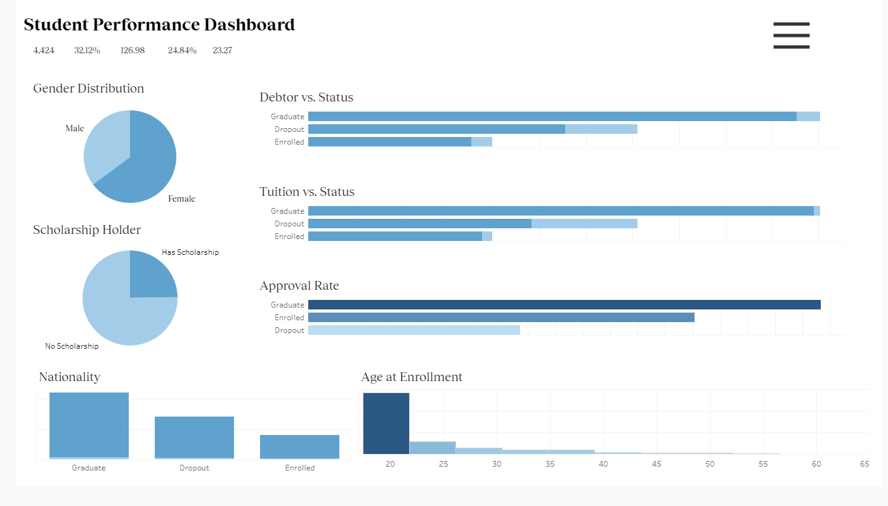

# Sistem Prediksi Status Kelulusan Mahasiswa

## Business Understanding
Perguruan tinggi sering menghadapi masalah putus kuliah (dropout) yang berdampak negatif pada beberapa aspek, termasuk reputasi institusi, efisiensi pendanaan, dan target kelulusan. Sistem prediksi dropout mahasiswa ini dikembangkan untuk membantu institusi pendidikan dalam mengidentifikasi mahasiswa yang berisiko tinggi dropout sejak dini, sehingga intervensi tepat dapat diberikan untuk mengurangi tingkat dropout.

### Business Problem
1. **Tingginya Tingkat Dropout**: Banyak institusi pendidikan mengalami tingkat dropout yang signifikan, yang berpengaruh pada metrik performa institusi.
2. **Keterlambatan Identifikasi**: Seringkali mahasiswa yang berisiko dropout teridentifikasi terlambat, saat intervensi sudah kurang efektif.
3. **Kurangnya Pendekatan Personalisasi**: Institusi sering kekurangan tools untuk merancang intervensi yang dipersonalisasi berdasarkan faktor risiko spesifik tiap mahasiswa.

### Project Scope
1. Data Prep
2. Exploratory Data Analysis
3. Visualize Dashboard
4. Pengembangan model machine learning untuk memprediksi kemungkinan mahasiswa mengalami dropout
5. Implementasi aplikasi web interaktif untuk memudahkan penggunaan model

### Preparation

**Data Source**:
- [Student's Performance Dataset](https://github.com/dicodingacademy/dicoding_dataset/tree/main/students_performance)
- [UCI Repository](https://archive.ics.uci.edu/dataset/697/predict+students+dropout+and+academic+success) 

**Setup environment**:
```bash
# Clone repositori
git clone https://github.com/username/student-performance-analysis.git
cd student-performance-analysis

# Instalasi dependensi
pip install -r requirements.txt

# Menjalankan aplikasi
streamlit run app.py
```

## Business Dashboard
Dashboard ini memberikan gambaran umum tentang data mahasiswa, termasuk statistik deskriptif, distribusi nilai, dan faktor-faktor yang berkontribusi pada risiko dropout. Dashboard ini dirancang untuk membantu pengambil keputusan dalam memahami pola dan tren yang ada dalam data.



Insight yang diperoleh dari dashboard ini antara lain:
- Dropout rate mencapai 32,12%, dengan proporsi mahasiswa laki-laki lebih rendah dibandingkan perempuan
- Pemegang beasiswa memiliki tingkat dropout yang lebih rendah dibandingkan mahasiswa tanpa beasiswa
- Mahasiswa yang memiliki hutang lebih cenderung dropout dibandingkan yang tidak memiliki hutang
- Mahasiswa yang telat bayar tuition lebih rentan untuk dropout dibandingkan yang tepat waktu
- Mahasiswa dengan approval rate dibawah 40% memiliki risiko dropout yang lebih tinggi

> [!NOTE]
> Link ke dashboard: [Student Performance Dashboard](https://public.tableau.com/views/student-dropout-dashboard/Dashboard)

## Cara Menjalankan Aplikasi

Untuk menjalankan aplikasi prediksi, ikuti langkah sederhana berikut di terminal Anda:

```bash
# Menjalankan aplikasi prediksi
streamlit run app.py
```

Setelah aplikasi berhasil dijalankan di browser Anda:
1.  Lengkapi formulir dengan data mahasiswa yang relevan untuk dianalisis.
2.  Klik tombol "**Predict**" untuk melihat hasil prediksi status kelulusan (Dropout atau Graduate).
3.  Jika sistem mendeteksi mahasiswa berisiko tinggi untuk dropout, Anda dapat mengklik tombol "**Generate Intervention Plan**" untuk mendapatkan rekomendasi rencana intervensi yang lebih terperinci dan personal.
4.  Gunakan informasi dan rencana intervensi ini sebagai dasar untuk menerapkan strategi dukungan yang paling tepat bagi mahasiswa tersebut.

## Kesimpulan Analisis Data

Berdasarkan analisis data yang telah dilakukan pada dataset mahasiswa, beberapa temuan kunci adalah:

-   **Demografi**: Mayoritas mahasiswa dalam dataset adalah perempuan dan berasal dari dalam negeri (domestik).
-   **Kinerja Akademik**: Terdapat korelasi positif yang sangat kuat antara kinerja akademik mahasiswa di semester pertama dan kedua. Mahasiswa yang berhasil di semester pertama cenderung melanjutkan kesuksesan di semester berikutnya. Sebaliknya, kesulitan di awal semester seringkali berlanjut. Nilai akademik semester 1 dan 2 adalah prediktor kuat untuk status kelulusan.
-   **Faktor Finansial**:
    -   Mahasiswa yang memiliki **status beasiswa** menunjukkan tingkat dropout yang **lebih rendah**.
    -   Mahasiswa yang tercatat sebagai **penunggak biaya kuliah (debtor)** atau **tidak membayar uang kuliah tepat waktu** memiliki kecenderungan **lebih tinggi untuk dropout**. Hal ini menggaris bawahi pentingnya stabilitas dan dukungan finansial.
-   **Faktor Akademik Lain**: Mahasiswa dengan **nilai persetujuan (approval rate) di bawah standar tertentu** (misalnya, < 40% seperti yang diindikasikan dalam analisis awal, atau berdasarkan jumlah mata kuliah yang disetujui dibandingkan yang diambil) memiliki risiko dropout yang lebih tinggi. Ini menunjukkan pentingnya dukungan akademik yang memadai.
-   **Latar Belakang Keluarga**: Terdapat korelasi antara tingkat pendidikan dan pekerjaan orang tua.
    -   Mahasiswa dengan orang tua yang memiliki pendidikan tinggi (misalnya, sarjana atau pascasarjana) cenderung memiliki tingkat dropout yang lebih rendah.
    -   Mahasiswa dari keluarga dengan latar belakang ekonomi yang lebih baik juga menunjukkan kecenderungan untuk menyelesaikan studi mereka.

## Rekomendasi Tindakan

Berdasarkan analisis data dan kemampuan sistem prediksi ini, berikut adalah beberapa rekomendasi tindakan yang dapat dipertimbangkan oleh institusi:

-   **Identifikasi & Intervensi Dini**: Manfaatkan sistem prediksi untuk mengidentifikasi mahasiswa berisiko sejak dini, terutama setelah hasil semester pertama keluar, mengingat korelasi kuat antar semester.
-   **Pemantauan Berkelanjutan**: Terapkan sistem pemantauan berkelanjutan untuk mahasiswa yang teridentifikasi berisiko tinggi, dengan evaluasi ulang secara berkala (misalnya, setiap semester).
-   **Program Pendampingan (Mentoring) Terstruktur**: Kembangkan program pendampingan akademik dan non-akademik yang dipersonalisasi, fokus pada area kelemahan yang teridentifikasi (akademik, finansial, sosial).
-   **Dukungan Finansial yang Tepat Sasaran**: Alokasikan sumber daya bantuan finansial (beasiswa, keringanan, opsi pembayaran fleksibel) secara proaktif kepada mahasiswa yang terdeteksi memiliki kesulitan finansial.
-   **Peningkatan Keterlibatan Mahasiswa**: Dorong partisipasi aktif mahasiswa dalam kegiatan akademik dan non-akademik di kampus untuk meningkatkan rasa memiliki (sense of belonging) dan keterikatan dengan institusi.
-   **Pembimbing Akademik Proaktif**: Latih pembimbing akademik untuk secara proaktif mendekati dan membangun hubungan dengan mahasiswa, terutama yang menunjukkan tanda-tanda awal risiko dropout (berdasarkan data akademik atau input dari sistem prediksi).
-   **Workshop Keterampilan Pendukung**: Selenggarakan workshop untuk membantu mahasiswa mengembangkan keterampilan belajar yang efektif, manajemen waktu, strategi menghadapi ujian, dan manajemen stres.

## Pengembang

Moh. Wahyu Abrory - [LinkedIn](http://linkedin.com/in/wahyuabrory)

*Copyright © 2025 - Hak Cipta Dilindungi*
